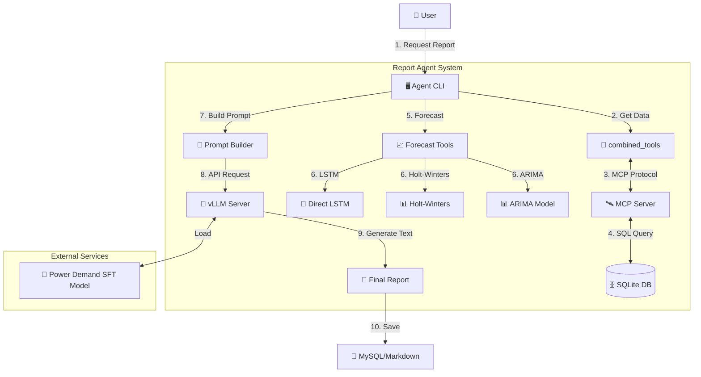

# 📊 Power Demand Report Agent

전력수요 특화 모델과 LangGraph 에이전트, MCP 기술을 결합하여 데이터 기반의 전력수요 분석 보고서를 자동으로 생성하는 시스템입니다.

## 🏗️ System Architecture

이 시스템은 크게 **Agent Layer**, **Data Layer (MCP Server)**, **Forecast Layer**, **LLM Layer (vLLM)** 네 가지 컴포넌트로 구성됩니다.



---

## 🧩 Components

| 컴포넌트 | 파일 경로 | 설명 |
|---|---|---|
| **Report Agent** | `report_agent/` | 사용자의 요청을 받아 전체 워크플로우를 조정하고 보고서를 생성합니다. |
| **MCP Server** | `mcp_server/server.py` | 전력수요 데이터(`demand.db`)에 접근하는 인터페이스를 제공합니다. 직접 SQL을 실행하여 데이터를 가져옵니다. |
| **Combined Tools** | `mcp_server/tools.py` | Agent가 MCP Server의 기능을 Python 함수처럼 호출할 수 있게 해주는 래퍼(Wrapper)입니다. |
| **Forecast Tools** | `mcp_server/tools.py` | 주차별 최대전력 예측을 위한 3가지 모델(ARIMA, Holt-Winters, LSTM)을 제공합니다. |
| **vLLM Server** | `serve_vllm.py` | 튜닝된 전력수요 예측 모델(`power_demand_merged_model`)을 OpenAI 호환 API로 서빙합니다. |

### 📂 Directory Structure

```
/root/De-Qwen-SFT/
├── serve_vllm.py              # vLLM 모델 서빙 스크립트 (Port 8000)
├── power_demand_merged_model/ # SFT 튜닝된 모델 가중치
├── best_direct_lstm_full.pth  # 주차별 예측용 LSTM 모델
├── scalers.pkl                # 데이터 정규화 스케일러
├── report_agent/              # 메인 에이전트 패키지
│   ├── generate_report.py     # 사용자 CLI 진입점
│   ├── mcp_server/            # 데이터 조회 계층
│   │   ├── server.py          # MCP API 서버 (Port 8001)
│   │   └── tools.py           # SQLite DB 조회 + 예측 모델 도구
│   └── demand_data/           # 데이터 저장소
│       └── demand.db          # 전력수요/기상 데이터 (SQLite)
```

---

## 🚀 Usage Guide

보고서를 생성하기 위해서는 **vLLM 서버**가 먼저 실행되어 있어야 합니다.

### 1단계: vLLM 모델 서버 실행
백그라운드에서 모델 서버를 실행합니다. (GPU 메모리 약 14GB 필요)

```bash
# /root/De-Qwen-SFT 디렉토리에서 실행
python serve_vllm.py --mode server --host 0.0.0.0 --port 8000  &
uv run -p 8000 serve_vllm.py --mode server --host 0.0.0.0 --port 8000
``` 
*서버가 완전히 뜰 때까지 약 1~2분 정도 소요될 수 있습니다.*

### 2단계: 보고서 생성
에이전트를 실행하여 특정 연월의 보고서를 생성합니다.

```bash
cd report_agent

# 2024년 8월 보고서 생성
python generate_report.py --year 2024 --month 8 --llm-url http://localhost:8000
```

### 3단계: 결과 확인
생성된 보고서는 `reports/` 디렉토리에 마크다운(`.md`) 파일로 저장됩니다.

```bash
ls -l reports/
cat reports/report_2024_08_llm_*.md
```

---

## 🛠️ Testing

시스템의 각 컴포넌트가 정상 작동하는지 테스트하려면:

```bash
# 전체 시스템 테스트 (MCP 도구, 보고서 생성기 등)
python test_system.py
```

---

## 📝 Example Output

**Generated Report Preview:**

> **2024년 8월 전력수요 분석 보고서**
>
> **1. 개요**
> 2024년 8월은 평균기온 27.5°C의 무더운 날씨로 인해 전력수요가 크게 증가했습니다...
> 
> **2. 전력수요 현황**
> - 최대부하: 9.7만kW (전년 대비 +3.5%)
> - 평균부하: 7.5만kW
>
> ...
