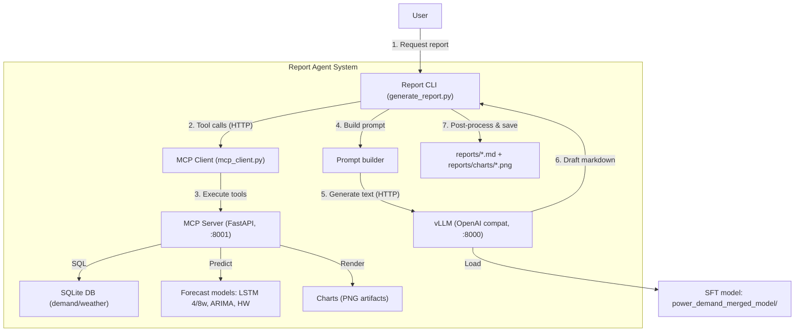

# Power Demand Report Agent (MCP-First)

전력수요(수요/기상) 데이터와 예측 모델(LSTM/ARIMA/Holt-Winters)을 기반으로 월간 전력수요 전망 보고서를 자동 생성하는 시스템입니다.

이 프로젝트의 설계 원칙은 아래 3가지입니다.

1) **정답이 필요한 것(수치/표/차트)**은 “툴”이 만든다. (DB 조회, YoY 계산, 예측, 차트 생성)  
2) **서술이 필요한 것(문장/요약/설명)**은 LLM(vLLM)이 만든다.  
3) 마지막으로 **CLI 후처리로 표/형식을 강제**해서 결과 품질을 안정화한다.

> 용어 정리  
> - 여기서 “MCP”는 **툴 호출 패턴(툴 서버 + 툴 디스커버리 + 툴 실행)**을 의미합니다.  
> - 현재 구현은 **FastAPI로 MCP 패턴을 구현**한 형태입니다(표준 MCP 런타임/SDK로의 전환 여지도 있음).

---

## 1) System Architecture

### 1.1 High-level Flow

- **Report CLI**: 보고서 생성 오케스트레이션(툴 호출 → 프롬프트 생성 → vLLM 호출 → 후처리 → 저장)
- **MCP Server**: DB/예측/차트를 “툴”로 제공(정답 생성)
- **vLLM Server**: 보고서 본문(서술) 생성



### 1.2 Why “FastAPI + MCP pattern”?

“그냥 CLI에서 DB/예측/차트까지 다 하면 되지 않나?”에 대한 설계 이유는 아래와 같습니다.

- **역할 분리(정답 vs 서술)**: 수치/표/차트는 코드가, 서술은 LLM이 담당하도록 분리해 정확도와 일관성을 확보
- **장기 실행/캐싱**: 예측 모델(LSTM) 가중치/스케일러 로딩을 서버 프로세스에 상주시켜 재사용 가능
- **재사용성**: CLI 외에 웹/배치/다른 서비스도 동일한 툴을 HTTP로 호출 가능
- **운영 편의**: FastAPI 기반이라 헬스체크/로그/배포가 쉬움

---

## 2) Repository Layout

핵심 파일만 요약합니다.

- `report_agent/generate_report.py`  
  보고서 생성 CLI 엔트리포인트(툴 호출 + LLM 호출 + 후처리 + 저장)
- `report_agent/mcp_client.py`  
  MCP 서버 호출 래퍼(httpx 기반)
- `report_agent/mcp_server/server.py`  
  MCP 서버(FastAPI) – 툴 엔드포인트 제공
- `report_agent/mcp_server/tools.py`  
  툴 구현(수요/기상 DB 조회, 예측 모델, 차트 생성)
- `report_agent/demand_data/demand.db`  
  SQLite DB(전력수요/기상)
- `serve_vllm.py`, `power_demand_merged_model/`  
  vLLM 서빙 스크립트 및 SFT 모델

예측 모델 아티팩트(레포 루트):
- `best_direct_lstm_full_4.pth`, `best_direct_lstm_full_8.pth`
- `scalers.pkl`

---

## 3) How to Run (Local)

보고서를 생성하려면 **MCP 서버(데이터/예측/차트)**와 **vLLM 서버**를 먼저 실행합니다.

### 3.1 Start MCP Server (Tools) – Port 8001

```bash
cd report_agent
python -m mcp_server.server --host 0.0.0.0 --port 8001
```

헬스체크:
```bash
curl http://localhost:8001/health
```

### 3.2 Start vLLM Server (LLM) – Port 8000

```bash
cd /root/De-Qwen-SFT
python serve_vllm.py --mode server --host 0.0.0.0 --port 8000 &
```

### 3.3 Generate Report (CLI → MCP → vLLM)

```bash
cd report_agent
python generate_report.py \
  --year 2025 --month 9 \
  --include-next-month \
  --mcp-url http://localhost:8001 \
  --llm-url http://localhost:8000
```

옵션 요약:
- `--mcp-url`: MCP 서버 URL(기본: `http://localhost:8001`)
- `--llm-url`: vLLM URL(없으면 “프롬프트만 저장” 모드)
- `--include-next-month`: 다음달 주차 예측 포함 + 표 분리 출력
- `--output`: 결과 저장 디렉토리(기본: `./reports`)

---

## 4) Output

기본 출력 구조:
- `report_agent/reports/report_YYYY_MM_llm_*.md`
- `report_agent/reports/charts/*.png`

품질 안정화 포인트:
- LLM 출력이 표/형식을 흔들 수 있으므로, CLI에서 표/단위/월 분리/그래프 위치 등을 후처리로 강제합니다.

---

## 5) MCP Tools (API)

MCP 서버는 “툴 실행”을 HTTP 엔드포인트로 제공합니다.

### 5.1 Tool Discovery
- `GET /mcp/tools`: 사용 가능한 툴 목록

### 5.2 Core Tools
- `POST /tools/get_report_data`  
  월 요약, 주차 실적, 과거 동월(기본 5개년), 기상 요약 등을 패키지로 반환
- `POST /tools/forecast_weekly_demand`  
  주차별 최대부하 예측(모델 선택 + include_next_month 지원)
- `POST /tools/get_yearly_monthly_demand`  
  연도별 월별 수요 데이터(차트/표용)
- `POST /tools/generate_yearly_monthly_chart`  
  연도별 월별 수요 차트(PNG) 생성 후 경로 반환

기존 툴:
- `POST /tools/get_demand_summary`
- `POST /tools/get_weekly_demand`
- `POST /tools/get_peak_load`
- `POST /tools/get_historical_demand`
- `POST /tools/generate_weekly_chart`

예시:
```bash
curl -X POST http://localhost:8001/tools/forecast_weekly_demand \
  -H "Content-Type: application/json" \
  -d '{"year":2025,"month":9,"model":"lstm","include_next_month":true}'
```

---

## 6) Design Notes (발표/설명용)

### 6.1 Why not LangGraph multi-agent?
- 이 문제는 “탐색/협상”보다 “정해진 절차의 자동화” 성격이 강함
- 형식/표 수치 정확성이 최우선이라 멀티에이전트 자율성이 리스크가 될 수 있음
- 필요해지면(대화형 분석/동적 플래닝/원인 추론 등) 그때 LangGraph로 확장하는 것이 합리적

### 6.2 What changes if we go “full standard MCP”?
툴 로직(`tools.py`)은 유지 가능하지만, 아래가 추가로 필요해집니다.
- 전송 레이어(HTTP → MCP SDK/프로토콜) 전환
- 차트(이미지) 아티팩트 전달 방식(base64/다운로드/스토리지 URL) 재설계
- LSTM 같은 무거운 모델을 위한 “상시 구동/캐싱” 운영 방식 정리

---

## 7) Troubleshooting

- MCP 서버 접속 실패:
  - `curl http://localhost:8001/health` 확인
  - 포트 충돌(8001) 확인
- vLLM 호출 실패:
  - 8000 포트, GPU 메모리, 모델 경로 확인
- 차트 생성 실패:
  - matplotlib 설치 여부, 출력 디렉토리 권한 확인
- DB 데이터 없음:
  - `report_agent/demand_data/demand.db` 존재/테이블/데이터 확인
