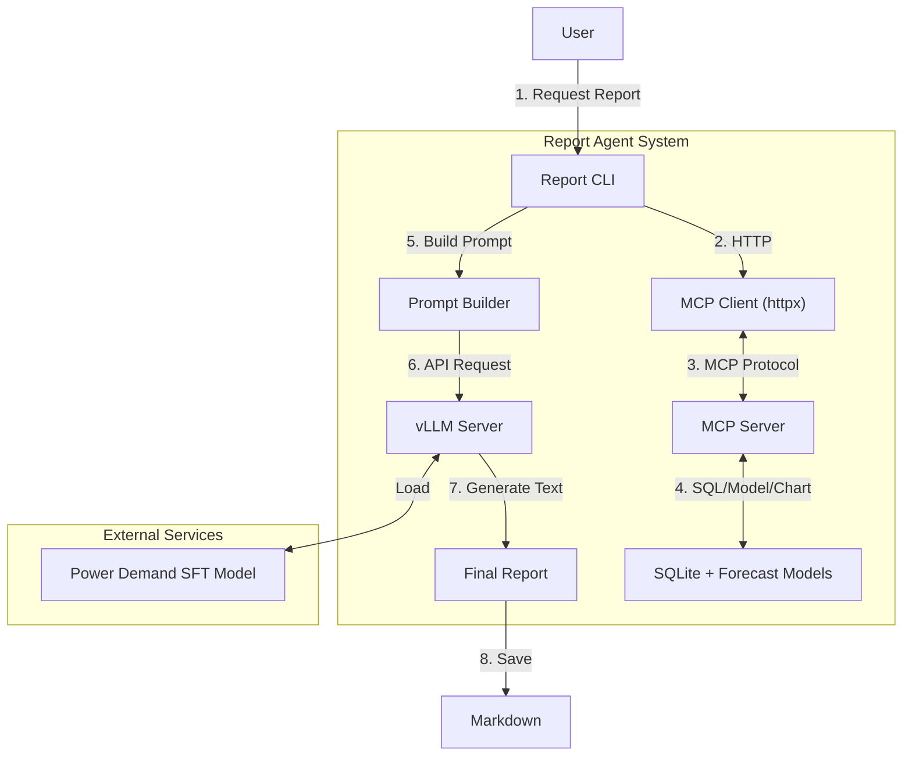

# 📊 Power Demand Report Agent (MCP-First)

전력수요 특화 모델과 MCP 도구(데이터/예측/차트), vLLM LLM을 조합해 전력수요 분석 보고서를 자동 생성합니다. **보고서 생성기는 MCP 서버를 통해서만 DB/예측/차트를 호출**하고, LLM 호출만 로컬에서 수행합니다.

## 🏗️ System Architecture

CLI(Report Generator) ↔ MCP Server ↔ DB/예측/차트, 그리고 LLM(vLLM)로 구성됩니다.



## 🧩 Components

| 컴포넌트 | 파일 경로 | 설명 |
|---|---|---|
| Report Generator (CLI) | `report_agent/generate_report.py` | 사용자 입력 → MCP 도구 호출 → 프롬프트 생성 → LLM 호출 → 후처리/저장 |
| MCP Client | `report_agent/mcp_client.py` | MCP 서버 HTTP 래퍼 (데이터/예측/차트 호출) |
| MCP Server | `report_agent/mcp_server/server.py` | FastAPI 도구 서버 (Port 8001) |
| MCP Tools | `report_agent/mcp_server/tools.py` | DB 조회, 예측(ARIMA/HW/LSTM), 차트 생성 로직 |
| LLM Server | `serve_vllm.py` | SFT 보고서/수요 모델을 vLLM(OpenAI 호환)으로 서빙 (Port 8000) |
| Data | `report_agent/demand_data/demand.db` | 전력/기상 데이터 (SQLite) |

### 📂 Directory Structure (요약)

```
/root/De-Qwen-SFT/
├── serve_vllm.py              # vLLM 서버 (8000)
├── power_demand_merged_model/ # SFT 모델 가중치
├── best_direct_lstm_full.pth  # 주차별 예측 LSTM 가중치(4/8주)
├── scalers.pkl                # 예측 스케일러
├── report_agent/
│   ├── generate_report.py     # 보고서 CLI (MCP 클라이언트 사용)
│   ├── mcp_client.py          # MCP HTTP 클라이언트
│   ├── mcp_server/
│   │   ├── server.py          # MCP API 서버 (8001)
│   │   └── tools.py           # DB 조회 + 예측 + 차트
│   └── demand_data/demand.db  # 전력/기상 SQLite
```

## 🚀 Usage Guide (MCP → vLLM)

보고서를 생성하려면 **MCP 서버(데이터/예측/차트)**와 **vLLM 서버**를 먼저 실행하세요.

### 1) MCP 서버 실행 (Port 8001)
```bash
cd report_agent
python -m mcp_server.server --host 0.0.0.0 --port 8001
```

### 2) vLLM 모델 서버 실행 (Port 8000)
```bash
# /root/De-Qwen-SFT
python serve_vllm.py --mode server --host 0.0.0.0 --port 8000 &
```

### 3) 보고서 생성 (CLI → MCP → vLLM)
```bash
cd report_agent
# 예: 2025년 9월, 다음달까지 전망 분리
python generate_report.py --year 2025 --month 9 --include-next-month \
  --llm-url http://localhost:8000 \
  --mcp-url http://localhost:8001
```

### 4) 결과 확인
```bash
ls -l reports/
cat reports/report_2025_09_llm_*.md
```

## 🔌 MCP Endpoints (필수)
- `POST /tools/get_report_data` : 요약/주차실적/과거/기상 패키지 반환
- `POST /tools/forecast_weekly_demand` : 주차별 최대부하 예측 (include_next_month 지원)
- `POST /tools/get_yearly_monthly_demand` : 연도별 월별 수요(차트용) 조회
- `POST /tools/generate_yearly_monthly_chart` : 연도별 월별 차트 생성(PNG 경로 반환)
- (기존) `get_demand_summary`, `get_weekly_demand`, `get_peak_load`, `get_historical_demand`, `generate_weekly_chart`

## 🧪 Testing
```bash
python test_system.py
```

## 📝 Notes
- CLI는 DB/모델을 직접 열지 않습니다. 모든 데이터/예측/차트는 MCP를 통해 호출합니다.
- 차트 PNG 경로는 MCP 서버가 생성 후 반환하며, 동일 머신 기준 상대경로 링크로 사용합니다.
