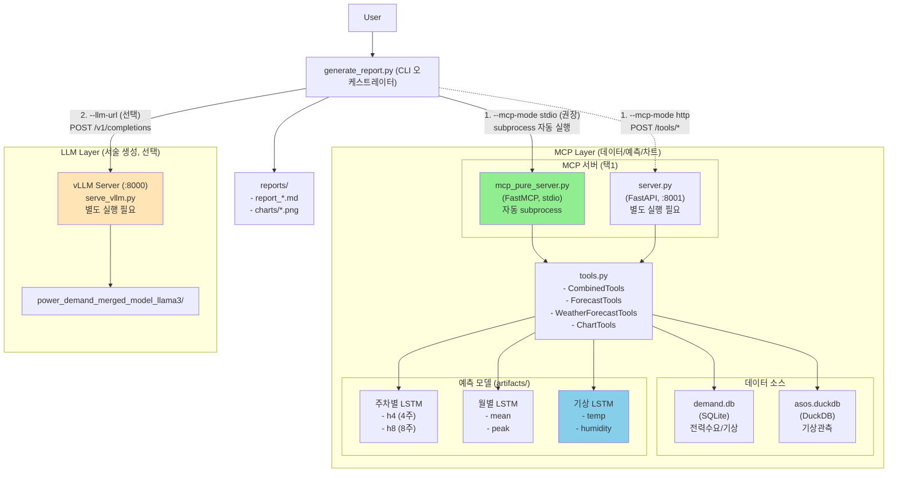
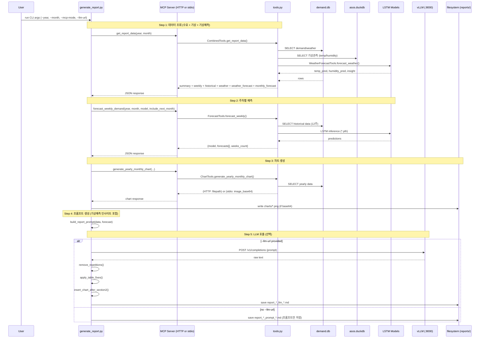

# Power Demand Report Agent

전력수요(수요/기상) 데이터와 예측 모델(LSTM/ARIMA/Holt-Winters), 그리고 SFT 튜닝된 LLM(vLLM)을 결합해 **월간 전력수요 전망 보고서(Markdown)**를 자동 생성합니다.

이 README는 "어떤 노드(컴포넌트)가 어떤 책임을 가지고, 어떤 순서로, 어떤 데이터 형태로 상호작용하는지"를 **코드 기준으로 완전히 구체화**한 문서입니다.

---

## 0) 설계 원칙 (역할 분리)

- **정답이 필요한 것**(수치/표/차트/예측)은 코드 기반 **Tools(MCP)**가 만든다: DB 조회, YoY 계산, 예측, 차트 렌더링
- **서술이 필요한 것**(문장/요약/설명)은 **LLM(vLLM)**이 만든다
- **품질 보증**은 CLI 후처리가 담당한다: 반복 제거, 표 형식 강제, 차트 링크 삽입

---

## 1) 아키텍처 (Mermaid node graph)

### 1.1 전체 구성도 (한 장으로 보는 노드)



### 1.2 보고서 생성 시퀀스 (정확한 실행 순서)

> 실제 구현 기준(파일/함수명): `report_agent/generate_report.py`의 HTTP 모드와 stdio 모드가 거의 동일한 순서로 동작합니다.



---

## 2) 실행 모드 (MCP 통신 방식)

### 2.1 MCP stdio 모드 (권장)

- CLI가 `report_agent/mcp_server/mcp_pure_server.py`를 **subprocess로 띄우고**, 표준입출력(stdio)으로 MCP 세션을 맺습니다.
- 네트워크 포트를 열지 않아도 되고(충돌/방화벽 이슈 감소), "한 번 실행해서 한 번 보고서 생성"에 적합합니다.
- 구현 파일:
  - 클라이언트: `report_agent/mcp_client_pure.py` (`ClientSession` + `mcp.client.stdio`)
  - 서버: `report_agent/mcp_server/mcp_pure_server.py` (`FastMCP`)

### 2.2 MCP HTTP 모드

- FastAPI 서버(`:8001`)를 별도 프로세스로 띄우고 CLI가 HTTP로 `/tools/*` 엔드포인트를 호출합니다.
- 구현 파일:
  - 클라이언트: `report_agent/mcp_client.py` (HTTP POST)
  - 서버: `report_agent/mcp_server/server.py` (FastAPI + uvicorn)

### 2.3 (참고) Pure MCP SSE 모드

- `mcp_client_pure.py`는 SSE도 지원하지만, `generate_report.py`는 현재 stdio만 사용합니다.
- 필요 시 확장 포인트: `MCPClientPure(mode="sse", server_url="http://localhost:8001/sse")`

---

## 3) 빠른 시작 (정확한 커맨드)

### 3.1 (선택) vLLM 서버 실행 (LLM로 "보고서 본문"까지 생성할 때)

```bash
cd /root/De-Qwen-SFT
python serve_vllm.py --mode server --host 0.0.0.0 --port 8000
```

`report_agent/generate_report.py`는 기본적으로 `POST {llm_url}/v1/completions`를 호출합니다.

### 3.2 MCP stdio 모드 (권장)

```bash
cd /root/De-Qwen-SFT/report_agent

# 1) 프롬프트만 저장 (LLM 없이)
python generate_report.py --year 2025 --month 11 --mcp-mode stdio

# 2) LLM까지 포함해 보고서 저장
python generate_report.py --year 2025 --month 11 --mcp-mode stdio --llm-url http://localhost:8000

# 3) 다음달까지 예측(8주) 포함
python generate_report.py --year 2025 --month 11 --mcp-mode stdio --include-next-month --llm-url http://localhost:8000
```

### 3.3 MCP HTTP 모드

```bash
# 터미널 1: MCP 서버 실행
cd /root/De-Qwen-SFT/report_agent
python -m mcp_server.server --port 8001

# 터미널 2: 보고서 생성
cd /root/De-Qwen-SFT/report_agent
python generate_report.py --year 2025 --month 11 --mcp-mode http --mcp-url http://localhost:8001 --llm-url http://localhost:8000
```

---

## 4) CLI 옵션 (generate_report.py)

```bash
python generate_report.py --year YYYY --month M [--mcp-mode http|stdio] [--mcp-url ...] [--llm-url ...] [--forecast-model ...] [--include-next-month] [--output ...] [--json] [--prompt-only]
```

| 옵션 | 의미 | 기본값/비고 |
|---|---|---|
| `--year` | 대상 연도 | 필수 |
| `--month` | 대상 월(1-12) | 필수 |
| `--mcp-mode` | `http` 또는 `stdio` | 기본 `http` |
| `--mcp-url` | HTTP 모드 MCP 서버 URL | 기본 `http://localhost:8001` |
| `--llm-url` | vLLM URL(없으면 프롬프트만 저장) | 없음 |
| `--forecast-model` | `lstm`, `arima`, `holt_winters`, `ensemble` | 기본 `lstm` |
| `--include-next-month` | 다음달까지 예측(8주) | 기본 `False` |
| `--output` | 출력 디렉토리 | 기본 `./reports` |
| `--json` | 보고서 대신 JSON 데이터 출력 | 디버그용 |
| `--prompt-only` | 프롬프트만 stdout 출력 | 파일 저장 안 함 |

---

## 5) 컴포넌트별 구성/동작 (파일 단위로 "무슨 일을 하는지")

### 5.1 오케스트레이터 (CLI)

- `report_agent/generate_report.py`
  - 입력(Args): `year/month`, `mcp-mode`, `forecast-model`, `include-next-month`, `llm-url`, `output`
  - MCP에서 가져오는 "정답 데이터":
    - `get_report_data(year, month)` → 요약/주차/과거/기상/기상예측/월예측 등 패키지
    - `forecast_weekly_demand(year, month, model, include_next_month)` → 주차별 최대수요 예측
    - `generate_yearly_monthly_chart(target_year, target_month, years, output_dir?)` → 차트(PNG or base64)
  - LLM 호출(선택): `POST {llm_url}/v1/completions`
  - 후처리(품질 보증): `remove_repetitions()`, `apply_table_fixes()`, `insert_chart_after_section2()`
  - 출력: `reports/report_YYYY_MM_{_llm_mcp|_prompt_mcp}_TIMESTAMP.md` (+ `reports/charts/*.png`)

### 5.2 Tools 서버 (HTTP)

- `report_agent/mcp_server/server.py`
  - FastAPI 기반
  - 주요 엔드포인트(일부):
    - `POST /tools/get_report_data`
    - `POST /tools/forecast_weekly_demand`
    - `POST /tools/generate_yearly_monthly_chart`
    - `GET /health`
  - 내부적으로 `CombinedTools()` / `ChartTools()`를 호출합니다.

### 5.3 Tools 서버 (Pure MCP)

- `report_agent/mcp_server/mcp_pure_server.py`
  - `FastMCP` 기반 "순수 MCP" 서버
  - 동일한 도구들을 `@mcp.tool()`로 노출합니다.
  - 실행 모드:
    - stdio: `python mcp_pure_server.py --mode stdio` (CLI가 자동 실행)
    - SSE: `python mcp_pure_server.py --mode sse --host 0.0.0.0 --port 8001` (선택)

### 5.4 Tools 구현 (DB/예측/차트)

- `report_agent/mcp_server/tools.py`
  - `DemandTools`: `demand_1hour` 기반 수요 요약/주차 집계/최대부하/과거동월
  - `WeatherTools`: `weather_1hour` 기반 월간 요약/과거동월 기상
  - `WeatherForecastTools`: **LSTM 기반 기온/습도 예측** ← (신규 추가)
    - 데이터 소스: `asos.duckdb` (DuckDB 기상관측 데이터)
    - 기온 예측 모델: `best_temp_lstm_full_monthly_temp1_win5.pth`
    - 습도 예측 모델: `best_hummidity_lstm_full_monthly_temp1_win5.pth`
    - 출력: 예측 기온/습도 + 전력수요 영향 인사이트 자동 생성
  - `ForecastTools`: ARIMA/HW/LSTM/Ensemble 예측 + 월별 예측(`monthly_forecast`)
    - 주차별 LSTM 모델/스케일러 로드:
      - 4주: `artifacts/models/best_direct_lstm_full_weekly_max_h4_win12.pth` + `artifacts/scalers/scalers_weekly_max_h4_win12.pkl`
      - 8주: `artifacts/models/best_direct_lstm_full_weekly_max_h8_win12.pth` + `artifacts/scalers/scalers_weekly_max_h8_win12.pkl`
    - 월별 LSTM(평균/피크): `artifacts/models/best_many2one_lstm_state_monthly_*.pth` + `artifacts/scalers/scalers_monthly_*.pkl`
  - `ChartTools`: matplotlib로 PNG 생성 (HTTP는 파일 경로 반환, Pure MCP는 base64 반환 가능)
  - `CombinedTools`: 보고서에 필요한 데이터 패키징(`get_report_data`)

### 5.5 LLM 서버 (vLLM)

- `serve_vllm.py`
  - `power_demand_merged_model_llama3/`을 OpenAI 호환 API로 서빙합니다.
  - `generate_report.py`는 기본적으로 `POST /v1/completions`로 호출합니다.

---

## 6) MCP Tool 스펙 (입력/출력 "필드" 단위)

아래 스펙은 `report_agent/mcp_server/tools.py` 구현(및 `server.py` 노출) 기준입니다.

### 6.1 수요/기상 조회

| Tool | 입력 | 출력(핵심 필드) |
|---|---|---|
| `get_demand_summary` | `year`, `month` | `max_demand`, `avg_demand`, `min_demand`, `yoy_change` |
| `get_weekly_demand` | `year`, `month` | 각 주차 `max_demand/avg_demand/min_demand`, `date_range`, `start_date/end_date` |
| `get_peak_load` | `year`, `month` | `peak_datetime`, `peak_date`, `peak_hour`, `peak_demand`, `weekday` |
| `get_historical_demand` | `month`, `years`, `target_year?` | 연도별 `max_demand`, `avg_demand`, `max_yoy`, `avg_yoy` 등 |
| `get_weather_summary` | `year`, `month` | `temperature_avg/max/min`, `humidity_avg` |
| `get_historical_weather` | `month`, `years`, `target_year?` | `years_data[]`, `avg_temperature`, `avg_humidity` |

### 6.2 기상 예측 (신규)

| Tool | 입력 | 출력(핵심 필드) |
|---|---|---|
| `forecast_weather` | `year`, `month` | `temp_mean_pred`, `humidity_mean_pred`, `insight` |

**`insight` 예시:**
- 여름(6-8월): "평균기온 28°C로 폭염 수준이 예상되어 냉방수요가 급증할 전망"
- 겨울(12-2월): "평균기온 -2°C로 혹한이 예상되어 난방수요가 급증할 전망"
- 습도 80%↑: "습도 82%로 높아 불쾌지수 상승에 따른 냉방수요 증가 예상"

### 6.3 전력수요 예측

| Tool | 입력 | 출력(핵심 필드) |
|---|---|---|
| `forecast_weekly_demand` | `year`, `month`, `model`, `include_next_month` | `model`, `weeks_count`, `forecasts[]` (`week`, `date_range`, `max_demand`, `month/year`(다음달 포함 시)) |
| `forecast_monthly_demand` | `year`, `month` | `avg_demand`, `max_demand`, `model_predictions{mean{lstm,holt_winters,arima}, peak{...}}` |

### 6.4 차트

| Tool | 입력 | 출력(핵심 필드) |
|---|---|---|
| `generate_yearly_monthly_chart` | `target_year`, `target_month`, `years`, (`output_dir`는 HTTP만) | `success`, (HTTP: `filepath`), (Pure MCP: `image_base64`) |
| `generate_weekly_chart` | `year`, `month` | `success`, `filepath` 또는 `image_base64` |

---

## 7) 데이터/출력 포맷

### 7.1 데이터 소스

| 데이터베이스 | 파일명 | 용도 | 주요 테이블 |
|---|---|---|---|
| SQLite | `demand_data/demand.db` | 전력수요 + 기상(시간별) | `demand_1hour`, `weather_1hour` |
| DuckDB | `asos.duckdb` | 기상관측(기상예측용) | `asos_hourly` |

### 7.2 SQLite 스키마 (핵심 테이블)

```sql
-- 전력수요 (시간별)
demand_1hour:
  - timestamp (datetime)
  - demand_mean, demand_max, demand_min (float)
  - is_holiday, day_type (int)

-- 기상 (시간별)
weather_1hour:
  - timestamp (datetime)
  - temperature_mean, temperature_max, temperature_min (float)
  - humidity_mean, humidity_max, humidity_min (float)
```

### 7.3 DuckDB 스키마 (기상예측용)

```sql
-- ASOS 기상관측 (시간별)
asos_hourly:
  - date (datetime)
  - temperature (float)
  - humidity (float)
```

### 7.4 출력 디렉토리

```
report_agent/reports/
├── report_2025_11_llm_mcp_YYYYMMDD_HHMMSS.md
├── report_2025_11_prompt_mcp_YYYYMMDD_HHMMSS.md
└── charts/
    └── yearly_monthly_demand_2025_11.png
```

---

## 8) 의존성 (필수 아티팩트/패키지)

### 8.1 필수 파일/폴더

| 구분 | 경로 | 설명 |
|---|---|---|
| **DB** | `report_agent/demand_data/demand.db` | 전력수요/기상 SQLite |
| **DB** | `asos.duckdb` (루트) | 기상관측 DuckDB |
| **LLM** | `power_demand_merged_model_llama3/` | vLLM 서빙 모델 |

#### 전력수요 예측 모델 (artifacts/)

| 파일명 | 용도 |
|---|---|
| `models/best_direct_lstm_full_weekly_max_h4_win12.pth` | 주차별 4주 예측 |
| `models/best_direct_lstm_full_weekly_max_h8_win12.pth` | 주차별 8주 예측 (다음달 포함) |
| `models/best_many2one_lstm_state_monthly_mean_win12.pth` | 월별 평균부하 예측 |
| `models/best_many2one_lstm_state_monthly_peak_win12.pth` | 월별 최대부하 예측 |
| `scalers/scalers_weekly_max_h4_win12.pkl` | 4주 모델 스케일러 |
| `scalers/scalers_weekly_max_h8_win12.pkl` | 8주 모델 스케일러 |
| `scalers/scalers_monthly_mean.pkl` | 월별 평균 스케일러 |
| `scalers/scalers_monthly_peak.pkl` | 월별 피크 스케일러 |

#### 기상 예측 모델 (루트 디렉토리)

| 파일명 | 용도 |
|---|---|
| `best_temp_lstm_full_monthly_temp1_win5.pth` | 기온 예측 LSTM |
| `best_hummidity_lstm_full_monthly_temp1_win5.pth` | 습도 예측 LSTM |
| `scalers_temp_monthly_temp1_win5.pl` | 기온 스케일러 |
| `scalers_hummidity_monthly_temp1_win5.pl` | 습도 스케일러 |

### 8.2 Python 패키지 (주요)

| 패키지 | 용도 |
|---|---|
| `mcp` | Pure MCP stdio/SSE |
| `fastapi`, `uvicorn` | HTTP 서버 |
| `httpx` | HTTP 클라이언트 |
| `torch` | LSTM 추론 |
| `pandas`, `numpy` | 데이터 처리 |
| `duckdb` | 기상 데이터 조회 |
| `statsmodels` | ARIMA, Holt-Winters |
| `matplotlib` | 차트 |
| `vllm` | LLM 서빙 |

---

## 9) 데이터 흐름 상세 (get_report_data)

`CombinedTools.get_report_data(year, month)` 호출 시 반환되는 데이터 구조:

```json
{
  "summary": {
    "year": 2025, "month": 11,
    "max_demand": 85460, "avg_demand": 72340, "min_demand": 58120,
    "yoy_change": 3.2
  },
  "weekly_demand": [
    {"week": 1, "date_range": "(11/1~11/3)", "max_demand": 82000, ...},
    ...
  ],
  "peak_load": {
    "peak_datetime": "2025-11-15 18:00:00",
    "peak_demand": 85460, "weekday": "Friday"
  },
  "historical": [
    {"year": 2021, "max_demand": 78000, "max_yoy": null, ...},
    {"year": 2022, "max_demand": 80500, "max_yoy": 3.2, ...},
    ...
  ],
  "weather": {
    "temperature_avg": 8.5, "temperature_max": 15.2, "temperature_min": 2.1,
    "humidity_avg": 62.3
  },
  "historical_weather": {
    "years_count": 5, "avg_temperature": 9.2, "avg_humidity": 58.5,
    "years_data": [...]
  },
  "weather_forecast": {
    "year": 2025, "month": 11,
    "temp_mean_pred": 7.8,
    "humidity_mean_pred": 65.2,
    "insight": "평균기온 7.8°C로 쌀쌀하여 난방수요가 조기에 증가할 수 있음"
  },
  "monthly_forecast": {
    "avg_demand": 73500, "max_demand": 86200,
    "model_predictions": {
      "mean": {"lstm": 73200, "holt_winters": 73800, "arima": 73500},
      "peak": {"lstm": 86500, "holt_winters": 85900, "arima": 86200}
    }
  },
  "weekday_pattern": [...],
  "weekend_pattern": [...]
}
```

---

## 10) Troubleshooting (현상 → 원인/확인 포인트)

| 증상 | 확인 포인트 |
|---|---|
| MCP 서버 연결 실패(HTTP) | `curl http://localhost:8001/health`, 포트 충돌, `--mcp-url` |
| Pure MCP stdio 실패 | `mcp` 패키지 설치, `report_agent/mcp_server/mcp_pure_server.py` 실행 가능 여부 |
| vLLM 호출 실패 | `--llm-url` 정확도, 8000 포트, GPU 메모리, `power_demand_merged_model_llama3/` 경로 |
| 예측 실패/빈 값 | `demand.db`에 과거 데이터 충분한지, `artifacts/models`/`artifacts/scalers` 존재 여부 |
| 차트 생성 실패 | `matplotlib` 설치, `report_agent/reports/` 쓰기 권한, 데이터 유무 |
| **기상 예측 실패** | `asos.duckdb` 존재 여부, `best_temp_lstm_*.pth` 모델 파일, `duckdb` 패키지 설치 |
| **DuckDB 잠금 오류** | 다른 프로세스에서 DB 사용 중, `asos_hourly_cache.parquet` 캐시 파일 확인 |
