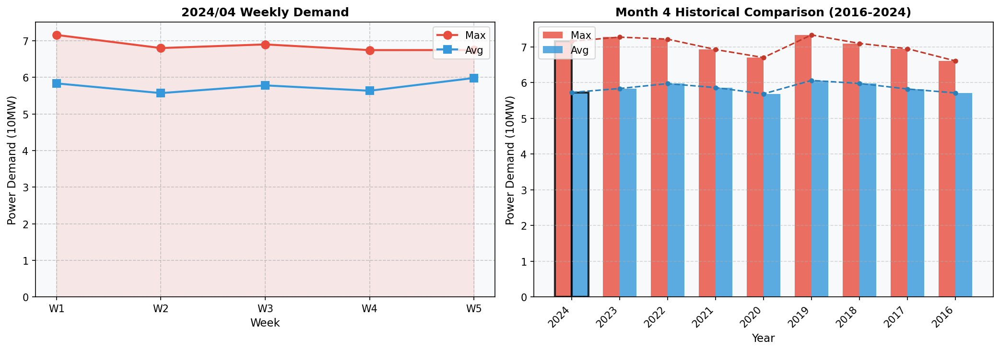

# 2024년 4월 전력수요 분석 보고서

## 1. 개요
2024년 4월 전력수요는 최대부하가 7.2만kW로 전년 대비 감소하였으며, 평균부하는 5.7만kW로 나타났습니다.

## 2. 전력수요 현황
- **최대부하**: 7.2만kW (전년 대비 -1.6%) 
- **평균부하**: 5.7만kW
- **최소부하**: 4.0만kW
- **최대부하 발생일**: 2024-04-03 9시 (Wednesday)

주별 전력수요는 다음과 같습니다:
- **1주차**: 최대 7.2만kW, 평균 5.8만kW
- **2주차**: 최대 6.8만kW, 평균 5.6만kW
- **3주차**: 최대 6.9만kW, 평균 5.8만kW
- **4주차**: 최대 6.7만kW, 평균 5.6만kW
- **5주차**: 최대 6.7만kW, 평균 6.0만kW

## 3. 기상 영향 분석
기상 영향을 고려하지 않았으나, 낮은 기온은 전력수요에 긍정적으로 작용할 것으로 예상됩니다.

## 4. 전년 동월 대비 분석
2024년 4월의 전력수요는 전년 대비 부하가 감소하였습니다. 이는 경제활동 재개와 함께 낮은 기온이 전력수요 증가를 억제한 결과라고 판단됩니다.

## 5. 결론
2024년 4월의 전력수요는 기온 하락과 경제활동 재개 등 다양한 요인이 복합적으로 작용하여 감소했습니다. 앞으로도 기후변화와 경제 상황이 중요한 변수로 여겨질 것입니다.

## 6. 주별 전력수요 추이 그래프

