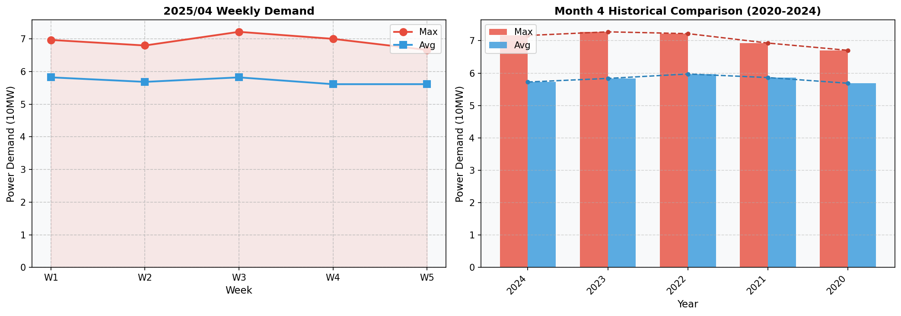

## 1. 기상전망
- 기온은 평균 12.9°C로 예상되며, 최저 기온은 -4.4°C에서 시작하여 최고 기온은 30.3°C까지 오르락내리락할 것으로 보입니다.
- 습도는 평균적으로 62.3%이며, 낮에는 더워지고 밤에는 차게 느껴질 것입니다.

## 2. 과거 전력수요 추이
최근 5개년 4월의 최대부하와 평균부하를 비교해보면, 최대부하는 연간 3.3%부터 1.5% 감소세를 보였으나, 2025년에는 다시 0.8% 상승할 것으로 예측됩니다. 평균부하는 2021년 이후 매년 증가하였으며, 2025년에도 -0.1%의 증가율을 보일 것으로 예상합니다.

| [단위: 만kW]            | 2021년4월   | 2022년4월   | 2023년4월   | 2024년4월   | 2025년4월   |
|-------------------------|-------------|-------------|-------------|-------------|-------------|
| 최대부하                | 6,927(+3.3%)| 7,218(+4.2%)| 7,273(+0.8%)| 7,160(-1.5%)| 7,216(+0.8%)|
| 평균부하                | 5,862(+3.1%)| 5,972(+1.9%)| 5,835(-2.3%)| 5,725(-1.9%)| 5,720(-0.1%)|

### 실적그래프

## 3. 전력수요 전망 결과
2025년 4월 주차별 최대부하는 다음과 같습니다:

| [단위: 만kW]        | 1주(4/1~4/6) | 2주(4/7~4/13) | 3주(4/14~4/20) | 4주(4/21~4/27) | 5주(4/28~4/30) |
|---------------------|--------------|---------------|----------------|----------------|----------------|
| 최대부하            | 6,968       | 6,798         | 7,216          | 7,001          | 6,661          |