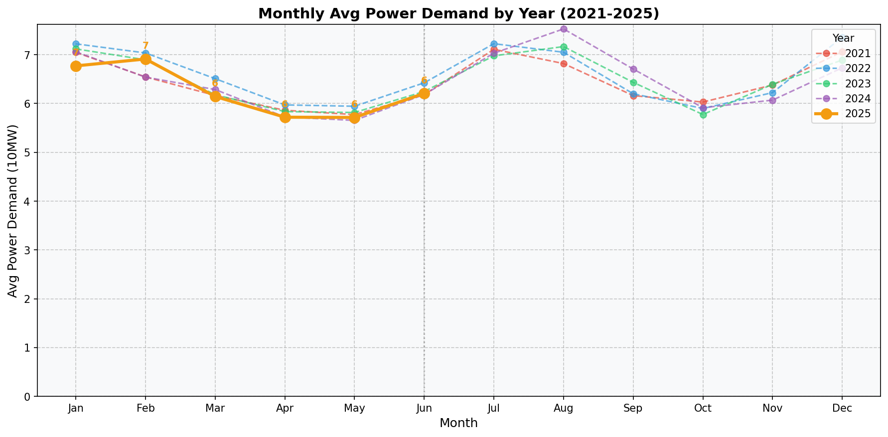

## 기상전망
- 기온: 평균 22.8°C (최고 36.4°C, 최저 5.3°C)
- 습도: 평균 습도 73.7%
- 고온 시 냉방수요 증가, 저온 시 난방수요 감소

## 과거 전력수요 추이
| 구분 | 2021년6월 | 2022년6월 | 2023년6월 | 2024년6월 | 2025년6월 |
|---|---:|---:|---:|---:|---:|
| 최대부하 | 7,616 (+0.4%) | 8,502 (+11.6%) | 8,287 (-2.5%) | 8,080 (-2.5%) | 7,943 (-1.7%) |
| 평균부하 | 6,182 (+4.6%) | 6,425 (+3.9%) | 6,247 (-2.8%) | 6,184 (-1.0%) | 6,120 (-1.0%) |

* [단위: 만kW, 증감률(%)]

## 전력수요 전망결과
### 6월 최대수요 전망
| 주차 | 1주(6/1~6/1) | 2주(6/2~6/8) | 3주(6/9~6/15) | 4주(6/16~6/22) | 5주(6/23~6/29) | 6주(6/30~6/30) |
|---|---:|---:|---:|---:|---:|---:|
| 최대부하(만kW) | 7,175 | 7,063 | 6,986 | 6,966 | 6,810 | 6,751 |

* [단위: 만kW]

### 7월 최대수요 전망
| 주차 | 1주(7/1~7/6) | 2주(7/7~7/13) | 3주(7/14~7/20) | 4주(7/21~7/27) | 5주(7/28~7/31) |
|---|---:|---:|---:|---:|---:|
| 최대부하(만kW) | 6,594 | 6,404 | 6,265 | 6,069 | 6,056 |

* [단위: 만kW]

| 주차     | 1주(7/1~7/6) | 2주(7/7~7/13) | 3주(7/14~7/20) | 4주(7/21~7/27) | 5주(7/28~7/31) |
|----------|--------------|---------------|----------------|----------------|----------------|
| 최대부하 | 6,594        | 6,404         | 6,265          | 6,069          | 6,056          | 
| [단위: 만kW] |            |              |               |                |                |

### 실적그래프

## 6월 전력수요 전망 : 예측값 (모델 3개의 평균)

### 평균부하 전망: 6,120 만kW
- LSTM: 6,115 만kW
- Holt-Winters: 6,219 만kW
- ARIMA: 6,026 만kW

### 최대부하 전망: 7,943 만kW
- LSTM: 7,464 만kW
- Holt-Winters: 8,347 만kW
- ARIMA: 8,018 만kW