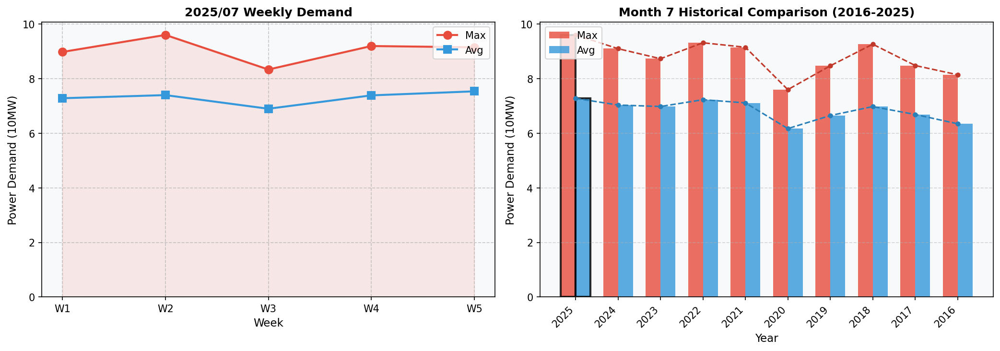

# 2025년 7월 전력수요 분석 보고서

## 1. 개요
2025년 7월 전력수요는 여름철 특성에 맞춰 점진적으로 증가하여 2주차에는 최대부하가 9.6만kW로 전년 대비 +5.5% 증가하였으며, 이후 하락세를 거듭합니다.

## 2. 전력수요 현황
최대부하는 2주차에 가장 높게 나타나며, 이 후 3주차와 4주는 각각 -19.6%, -4.3% 감소한 반면, 마지막 주에는 다시 4.4% 증가하였습니다. 평균부하는 주별로 일정하게 증가하다가 4주차에서 약간 낮아졌다가 다시 오르는 패턴을 보였습니다. 

| 주   | 최대부하(kW) | 평균부하(kW) |
|------|-------------|--------------|
| 1    | 9.0         | 7.3          |
| 2    | 9.6         | 7.4          |
| 3    | 8.3         | 6.9          |
| 4    | 9.2         | 7.4          |
| 5    | 9.1         | 7.5          |

## 3. 기상 영향 분석
기상 조건은 전력수요에 중요한 역할을 합니다. 특히, 폭염과 더위는 공기 중의 습기를 증가시키면서 에어컨 등의 사용량을 크게 늘립니다. 이번 달에도 평균기온이 27.2°C로 높았으며, 이를 고려하면 전력수요의 큰 폭의 변동성을 설명할 수 있습니다.

## 4. 전년 동월 대비 분석
2025년 7월의 최대부하는 전년 대비 5.5% 증가했지만, 평균부하는 오히려 -1.3% 줄었습니다. 이러한 차이는 기후 조건과 관련된 것이며, 특히 폭염 기간 내내 많은 사람들이 에어컨을 쓴 결과로 보입니다.

## 5. 결론
2025년 7월 전력수요는 여름철 특성을 잘 따랐으며, 기온과 직접적인 연관성이 있음을 확인했습니다. 또한, 기후변화와 같은 다양한 요인이 전력수요에 미치는 영향을 계속해서 모니터링해야 함을 시사하고 있습니다.

## 6. 주별 전력수요 추이 그래프

