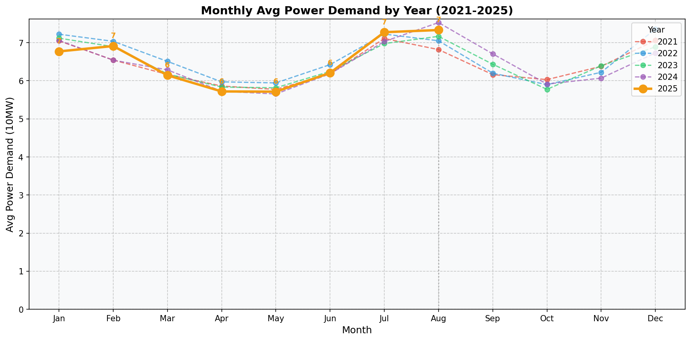

## 기상전망
- 기온은 평균 27.3°C로 예보되며, 가장 높은 온도는 37.7°C, 가장 낮은 온도는 12.1°C입니다.
- 높은 습도인 79.8%로 인해 냉방 수요가 크게 발생할 것으로 예상됩니다.

## 과거 전력수요 추이
| 구분 | 2021년8월 | 2022년8월 | 2023년8월 | 2024년8월 | 2025년8월 |
|---|---:|---:|---:|---:|---:|
| 최대부하 | 8,705 (-2.8%) | 8,961 (+2.9%) | 9,412 (+5.0%) | 9,744 (+3.5%) | 8,283 (-15.0%) |
| 평균부하 | 6,820 (+1.0%) | 7,051 (+3.4%) | 7,168 (+1.7%) | 7,529 (+5.0%) | 7,036 (-6.5%) |

* [단위: 만kW, 증감률(%)]

최대부하는 2021년부터 매년 증가했으나, 2025년에는 -15.0% 감소한 것으로 나타났습니다. 

## 전력수요 전망결과
### 8월 최대수요 전망
| 주차 | 1주(8/1~8/3) | 2주(8/4~8/10) | 3주(8/11~8/17) | 4주(8/18~8/24) | 5주(8/25~8/31) |
|---|---:|---:|---:|---:|---:|
| 최대부하(만kW) | 8,283 | 7,499 | 7,614 | 6,711 | 7,343 |

* [단위: 만kW]

### 9월 최대수요 전망
| 주차 | 1주(9/1~9/7) | 2주(9/8~9/14) | 3주(9/15~9/21) | 4주(9/22~9/28) | 5주(9/29~9/30) |
|---|---:|---:|---:|---:|---:|
| 최대부하(만kW) | 7,117 | 6,731 | 6,394 | 6,450 | 6,221 |

* [단위: 만kW]

### 실적그래프

## 2. 과거 전력수요 추이
