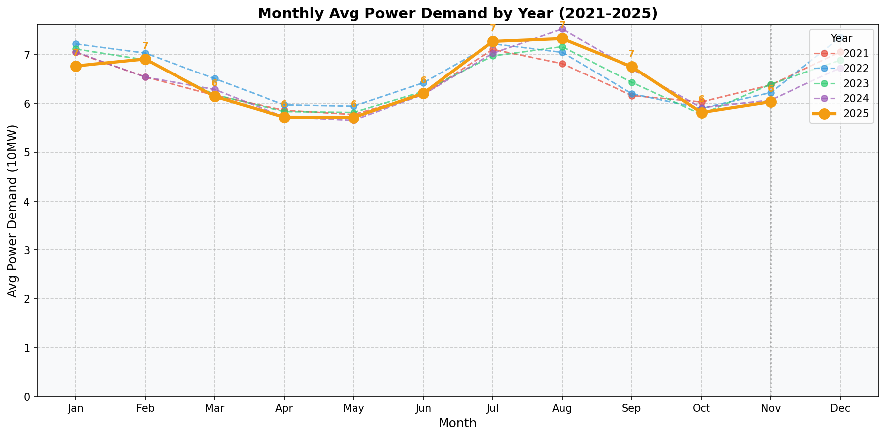

## 1. 기상전망
- 기온: 평균 9.1°C (최고 23.5°C, 최저 -10.2°C)
- 습도: 평균 습도 64.4%
- 기온이 상승하면 냉방수요가 증가하고, 기온이 하락하면 난방수요가 증가합니다.

## 2. 과거 전력수요 추이

### 실적그래프

| 구분 | 2021년11월 | 2022년11월 | 2023년11월 | 2024년11월 | 2025년11월 |
|---|---:|---:|---:|---:|---:|
| 최대부하 | 8,076 (+3.7%) | 8,269 (+2.4%) | 8,334 (+0.8%) | 7,940 (-4.7%) | 7,757 (-2.3%) |
| 평균부하 | 6,380 (+3.9%) | 6,224 (-2.4%) | 6,394 (+2.7%) | 6,070 (-5.1%) | 6,092 (+0.4%) |

* [단위: 만kW, 증감률(%)]

## 3. 전력수요 전망결과
### 11월 최대수요 전망
| 주차 | 1주(11/1~11/2) | 2주(11/3~11/9) | 3주(11/10~11/16) | 4주(11/17~11/23) | 5주(11/24~11/30) |
|---|---:|---:|---:|---:|---:|
| 최대부하(만kW) | 7,192 | 7,064 | 6,958 | 6,897 | 6,824 |

* [단위: 만kW]

### 12월 최대수요 전망
| 주차 | 1주(12/1~12/7) | 2주(12/8~12/14) | 3주(12/15~12/21) | 4주(12/22~12/28) | 5주(12/29~12/31) |
|---|---:|---:|---:|---:|---:|
| 최대부하(만kW) | 6,756 | 6,544 | 6,465 | 6,196 | 5,984 |

* [단위: 만kW]

| 주차     | 1주(12/1~12/7) | 2주(12/8~12/14) | 3주(12/15~12/21) | 4주(12/22~12/28) | 5주(12/29~12/31) |
|----------|--------------:|---------------:|------------------:|------------------:|------------------:|
| 최대부하 | 6,756         | 6,544          | 6,465             | 6,196             | 5,984             |

## 11월 전력수요 전망 : 예측값 (모델 3개의 평균)

### 평균부하 전망: 6,092 만kW
- LSTM: 6,183 만kW
- Holt-Winters: 6,232 만kW
- ARIMA: 5,859 만kW

### 최대부하 전망: 7,757 만kW
- LSTM: 7,412 만kW
- Holt-Winters: 8,391 만kW
- ARIMA: 7,468 만kW